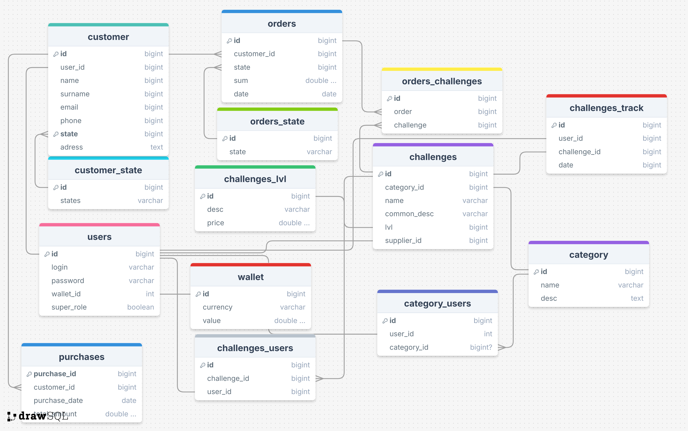

//

//
orders_state — хранит возможные состояния заказов.

id — уникальный идентификатор состояния.
state — текстовое описание состояния (например, "в процессе", "завершен").
category_users — связь между пользователями и категориями, к которым они принадлежат.

id — уникальный идентификатор.
user_id — ссылка на пользователя.
category_id — ссылка на категорию (если применимо).
challenges_users — связь между пользователями и задачами, над которыми они работают.

id — уникальный идентификатор.
challenge_id — ссылка на задачу.
user_id — ссылка на пользователя.
users — содержит информацию о пользователях.

id — уникальный идентификатор пользователя.
login, password — данные для авторизации.
wallet_id — ссылка на кошелек.
super_role — флаг административной роли.
orders_challenges — связь между заказами и задачами, связанными с ними.

id — уникальный идентификатор.
order — ссылка на заказ.
challenge — ссылка на задачу.
purchases — хранит информацию о покупках клиентов.

purchase_id — уникальный идентификатор покупки.
customer_id — ссылка на клиента.
purchase_date, total_amount — дата покупки и общая сумма.
orders — информация о заказах.

id — уникальный идентификатор.
customer_id — ссылка на клиента.
state — состояние заказа.
sum — сумма заказа.
date — дата заказа.
customer_state — хранит состояния клиентов.

id — уникальный идентификатор состояния.
states — описание состояния клиента.
category — категории задач.

id — уникальный идентификатор.
name, desc — название и описание категории.
challenges — задачи для выполнения пользователями.

id — уникальный идентификатор задачи.
category_id, name, common_desc — категория, название и описание задачи.
lvl, supplier_id — сложность задачи и поставщик.
customer — информация о клиентах.

id — уникальный идентификатор.
user_id, name, surname, email, phone, state, adress — данные клиента.
challenges_lvl — уровни сложности задач.

id — уникальный идентификатор уровня.
desc, price — описание уровня и цена.
wallet — данные о кошельках пользователей.

id — уникальный идентификатор.
currency, value — валюта и текущий баланс.
challenges_track — отслеживание выполнения задач пользователями.

id — уникальный идентификатор.
user_id, challenge_id, date — пользователь, задача, дата выполнения.

//
Отслеживание выполнения задач пользователями
Контроль заказов и покупок    

//
Смысл приложения состоит в том ,чтобы создать цикл челенджей 
user приобритает челенджи и получает валюту которую снова тратит на покупку челенджей
при этом все происходит в открытом формате 
побеждает тот юзер который нкопил больше валюты ,так как в конце ваюта переводится в игровые очки 

